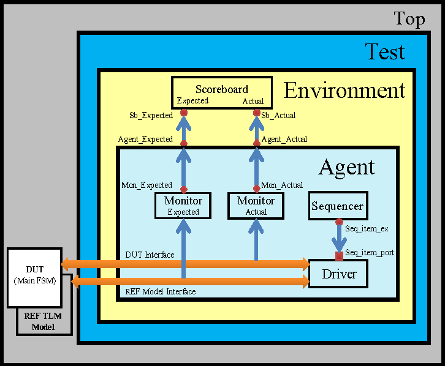

# ALU Design with Universal Verification Methodology(UVM) based Verification

Simple ALU design with UVM based verification environment.
Tool used		  : Mentor Graphics QuestaSim 10.7
Verification environment : UVM

Script which I used to run this test is not added in this repository. This is basically a sample ALU design uvm based verification tutorial like repository, from which new comers in field of Verification can learn and have a clear idea about how UVM works.

